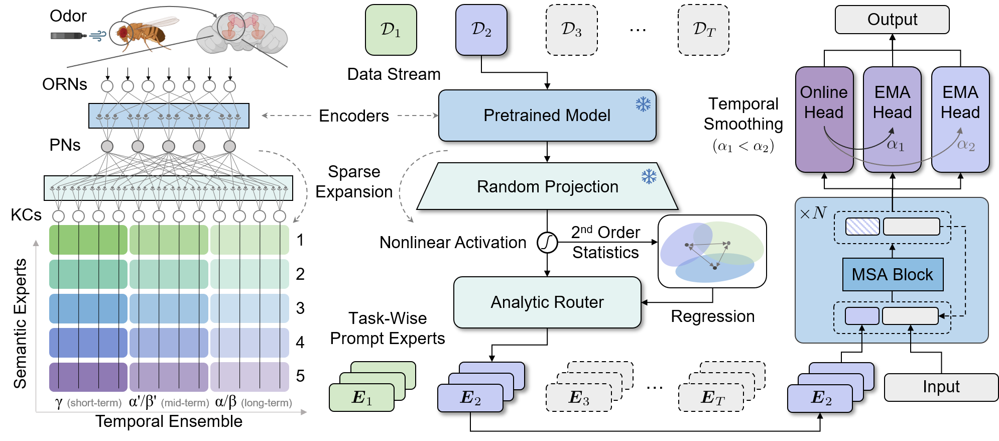

# FlyGCL: Marco ligero para Aprendizaje Continuo (líneas base de FlyPrompt y ViT)

<p align="center">
  <a href="https://www.arxiv.org/abs/2602.01976"></a>
  <a href="https://huggingface.co/HoraceYan/FlyGCL"></a>
  <a href="https://github.com/AnAppleCore/FlyGCL"></a>
  <a href="https://hits.sh/github.com/AnAppleCore/FlyGCL/"></a>
  <a href="LICENSE"></a>
  <a href="https://github.com/AnAppleCore/FlyGCL/commits/main"></a>
</p>

FlyGCL es un marco práctico para el **Aprendizaje Continuo General (GCL) / aprendizaje incremental por clases en línea** en imágenes, con un enfoque en la configuración **Si-Blurry**. Incluye múltiples líneas base basadas en modelos preentrenados construidas sobre Vision Transformers (ViT) y un ejecutor ligero para reproducir experimentos. **FlyPrompt** es nuestro método propuesto, que utiliza enrutamiento expandido aleatoriamente y expertos de ensamble temporal para abordar eficazmente el problema de GCL, logrando mejoras significativas en los principales benchmarks.

<p align="center">
  
</p>

## 📦 Contenido

- **Métodos**: `flyprompt` (nuestro), `l2p`, `dualprompt`, `codaprompt`, `mvp`, `misa`, `slca`, `sprompt`, `ranpac`, `hide` (prompt/lora/adapter), `norga`, `sdlora`
- **Backbones**: ViT a través de `timm` y una implementación local de ViT (`models/vit.py`) que admite múltiples fuentes preentrenadas
- **Configuración**: verdadero Si-Blurry en línea con proporciones disjuntas/desdibujadas configurables
- **Salidas**: registros y artefactos numpy/json bajo `results/`

## 🛠️ Instalación (Linux)

### Entorno Python

- **Python**: 3.10+
- **PyTorch / CUDA**: siga las instrucciones oficiales de PyTorch para su versión de CUDA y luego instale las dependencias restantes.

Recomendamos:

```bash
python -m venv .venv
source .venv/bin/activate
pip install -U pip
pip install -r requirements.txt
```

Notas:

- `requirements.txt` fija una pila completa (incluyendo `torch/torchvision`). Si prefiere instalar PyTorch desde un índice de wheel específico de CUDA, instale PyTorch primero y luego instale los demás paquetes en consecuencia.

## 🗂️ Conjuntos de datos

FlyGCL utiliza `--data_dir` como **ruta raíz del conjunto de datos**. Diferentes conjuntos de datos esperan diferentes subestructuras (consulte a continuación).

### Estructura de directorios recomendada

```text
FlyGCL/
  data/                          # predeterminado ./data
    CIFAR/                       # para CIFAR-10/100 (torchvision)
    imagenet-r/                  # para ImageNet-R (ver requisito de división a continuación)
      train/
        <class_name>/*.jpg
      test/
        <class_name>/*.jpg
    CUB_200_2011/                # para CUB-200-2011
      images/
        <class_name>/*.jpg
```

Puede cambiar la ruta raíz mediante:

- **CLI**: `--data_dir /your/path`
- **Scripts de líneas base**: establezca `DATA_ROOT=/your/path` (los scripts usan `${DATA_ROOT}/CIFAR`, `${DATA_ROOT}/imagenet-r`, `${DATA_ROOT}/CUB_200_2011` por defecto)

### Enlaces de descarga (benchmarks comunes)

- **CIFAR-100**: torchvision puede descargar automáticamente. Página oficial: `https://www.cs.toronto.edu/~kriz/cifar.html`
- **ImageNet-R (Rendición)**:
  - Página del proyecto: `https://github.com/hendrycks/imagenet-r`
  - Tarball (según se referencia en los comentarios de nuestro código de conjuntos de datos): `https://people.eecs.berkeley.edu/~hendrycks/imagenet-r.tar`
  - **Nota**: nuestro cargador activo espera `imagenet-r/train/` y `imagenet-r/test/`. Si su descarga no incluye esta división, cree una división (por ejemplo, 80/20 por clase) y coloque las imágenes en las carpetas `train/` y `test/`.
- **CUB-200-2011**:
  - Página oficial: `https://www.vision.caltech.edu/datasets/cub_200_2011/`
  - Tgz directo (imágenes+anotaciones): `https://data.caltech.edu/records/65de6-vp158/files/CUB_200_2011.tgz`
  - Después de la extracción, apunte `--data_dir` a la carpeta extraída `CUB_200_2011/` (la que contiene `images/`).

### Notas sobre `download=True`

El entrenador actualmente llama a los constructores de conjuntos de datos con `download=True`, pero **la mayoría de los conjuntos de datos personalizados en `datasets/` tienen el código de descarga/extracción comentado**. En la práctica:

- **CIFAR-10/100** (torchvision) puede descargarse automáticamente en `--data_dir`.
- Muchos otros (p. ej., ImageNet-R, CUB, Cars) requieren **descarga manual + estructura de carpetas correcta**.

## 🧩 Puntos de control (backbones preentrenados y checkpoints de prompts)

Enlaces de descarga de checkpoints:

- **Hugging Face**: [Hugging Face Project](https://huggingface.co/HoraceYan/FlyGCL)
- **Baidu Netdisk**: [Enlace de descarga](https://pan.baidu.com/s/14Cf83kIrx3grjMSuPlAV5g?pwd=39wb) (código: `39wb`)

### Dónde colocar los archivos

Por favor, cree una carpeta local:

```text
FlyGCL/
  checkpoints/
    (archivos listados a continuación)
```

Notas:

- `checkpoints/` es ignorado por git (`.gitignore`), por lo que debe descargar y colocar los archivos manualmente.
- `models/vit.py` también buscará algunos pesos `.npz` bajo `~/.cache/torch/hub/checkpoints/` (caché de torch hub, para `vit_base_patch16_224`).

### Checkpoints locales de backbones compatibles (ViT-B/16)

Cuando establezca `--backbone` en uno de los siguientes, `models/vit.py` intentará cargar un archivo local cuando `pretrained=True`:

`run.sh` también utiliza `vit_base_patch16_224` por defecto, lo que requiere colocar los pesos `ViT-B_16.npz` bajo `~/.cache/torch/hub/checkpoints/`.

| Nombre del modelo | Valor de `--backbone`                 | Nombre de archivo esperado                                |
| ----------- | ---------------------------------- | ------------------------------------------------- |
| Sup-21K     | `vit_base_patch16_224`             | `ViT-B_16.npz`                                    |
| Sup-21K/1K  | `vit_base_patch16_224_mepo_21k_1k` | `vit_21k_1k_mepo_epoch_0.pth`                     |
| iBOT-21K    | `vit_base_patch16_224_21k_ibot`    | `checkpoint.pth` (espera la clave `teacher`)          |
| iBOT-1K     | `vit_base_patch16_224_ibot`        | `ibot_vitbase16_pretrain.pth`                     |
| DINO-1K     | `vit_base_patch16_224_dino`        | `dino_vitbase16_pretrain.pth`                     |
| MoCo v3-1K  | `vit_base_patch16_224_mocov3`      | `mocov3-vit-base-300ep.pth` (espera la clave `model`) |

### Checkpoints de prompts (MISA)

`MISA` (basado en `DualPrompt`) carga tensores de prompts desde archivos locales cuando pasa `--load_pt`:

- `./checkpoints/g_prompt.pt`
- `./checkpoints/e_prompt.pt`

Los checkpoints de prompts se distribuyen a través de los mismos enlaces anteriores.

## 🚀 Inicio rápido (FlyPrompt)

Una sola GPU, CIFAR-100, Si-Blurry (n=50, m=10), 5 tareas:

```bash
python main.py \
  --method flyprompt \
  --dataset cifar100 \
  --data_dir ./data/CIFAR \
  --backbone vit_base_patch16_224 \
  --n_tasks 5 --n 50 --m 10 \
  --batchsize 64 --lr 0.005 \
  --online_iter 3 --num_epochs 1 \
  --use_amp --eval_period 1000 \
  --note flyprompt_cifar100
```

Ejemplo de ImageNet-R (requiere `./data/imagenet-r/train` y `./data/imagenet-r/test`):

```bash
python main.py \
  --method flyprompt \
  --dataset imagenet-r \
  --data_dir ./data/imagenet-r \
  --backbone vit_base_patch16_224 \
  --n_tasks 5 --n 50 --m 10 \
  --batchsize 32 --lr 0.005 \
  --online_iter 3 --num_epochs 1 \
  --use_amp --eval_period 1000 \
  --note flyprompt_imagenet_r
```

## 🏃 Ejecución de scripts de líneas base (`scripts/`)

Proporcionamos scripts de bash listos para ejecutar bajo `scripts/`:

- Establezca el **intérprete de Python** con la variable de entorno `PYTHON` (por defecto `python`)
- Establezca la **raíz del conjunto de datos** con la variable de entorno `DATA_ROOT` (por defecto `./data`)

Ejemplo:

```bash
export DATA_ROOT=./data
export PYTHON=python
bash scripts/run_baselines_flyprompt.sh 0 "1 2 3" cifar100 flyprompt_minimal
```

Siempre puede anular la ruta del conjunto de datos por ejecución pasando `--data_dir ...` como argumentos adicionales:

```bash
bash scripts/run_baselines_flyprompt.sh 0 "1 2 3" cifar100 note --data_dir /mnt/datasets/CIFAR
```

### `run.sh` (ejecutor multisesión)

`run.sh` inicia varios scripts de líneas base mediante `screen`. Si planea usarlo, asegúrese de que `screen` esté instalado.

## 🔧 Argumentos clave

- **Método/conjunto de datos**: `--method {flyprompt|l2p|dualprompt|codaprompt|mvp|slca|ranpac|...}` `--dataset {cifar100|imagenet-r|cub200|...}` `--data_dir /ruta`
- **Configuración**: `--n_tasks 5` `--n 50` (proporción de clases disjuntas, %) `--m 10` (proporción de muestras desdibujadas, %)
- **Entrenamiento**: `--batchsize 64` `--lr 0.005` `--online_iter 3` `--num_epochs 1` `--use_amp` `--eval_period 1000`
- **Backbone**: `--backbone vit_base_patch16_224` (o una de las variantes de checkpoint local)
- **Reproducción**: `--seeds 1 2 3` `--note mi_experimento`

## 📁 Salidas

Las salidas se almacenan bajo `results/`:

```text
results/
  logs/{dataset}/{note}/
    seed_{seed}.npy
    seed_{seed}_eval.npy                 # si eval_period está habilitado
    seed_{seed}_eval_time.npy            # si eval_period está habilitado
```

Al ejecutar mediante `scripts/*.sh`, la salida de la consola se captura adicionalmente con `tee` en:

- `results/logs/{dataset}/{note}/seed_{SEEDS}_log.txt`

## 🧱 Estructura del proyecto

- `main.py`: punto de entrada (carga argumentos, construye el entrenador, ejecuta)
- `configuration/config.py`: definiciones de argumentos
- `methods/`: entrenadores (p. ej., `methods/flyprompt.py`)
- `models/`: componentes del modelo (p. ej., `models/flyprompt.py`, `models/vit.py`)
- `datasets/`: envolturas de conjuntos de datos
- `scripts/`: iniciadores de líneas base

## 🙏 Agradecimientos

Agradecemos sinceramente a los autores y mantenedores de los siguientes proyectos y recursos de código abierto. Partes de esta base de código se adaptan o inspiran en ellos:

- [MISA](https://github.com/kangzhiq/MISA)
- [l2p-pytorch](https://github.com/JH-LEE-KR/l2p-pytorch)
- [RanPAC](https://github.com/RanPAC/RanPAC)
- [HiDe-Prompt](https://github.com/thu-ml/HiDe-Prompt)
- [MoE_PromptCL](https://github.com/Minhchuyentoancbn/MoE_PromptCL)
- [SD-Lora-CL](https://github.com/WuYichen-97/SD-Lora-CL)

## 📝 Citación

Si este repositorio ayuda en su investigación, por favor cite nuestro artículo:

```bibtex
@inproceedings{flyprompt2026,
  title={FlyPrompt: Brain-Inspired Random-Expanded Routing with Temporal-Ensemble Experts for General Continual Learning},
  author={Yan, Hongwei and Sun, Guanglong and Zhou, Kanglei and Li, Qian and Wang, Liyuan and Zhong, Yi},
  booktitle={ICLR},
  year={2026}
}
```

## ✉️ Contacto

Si tiene alguna pregunta o sugerencia, no dude en informar problemas o contactarnos:

- Mantenedor: **Hongwei Yan** (`yanhw22@mails.tsinghua.edu.cn`)

## 📄 Licencia

MIT. Consulte `LICENSE`.
